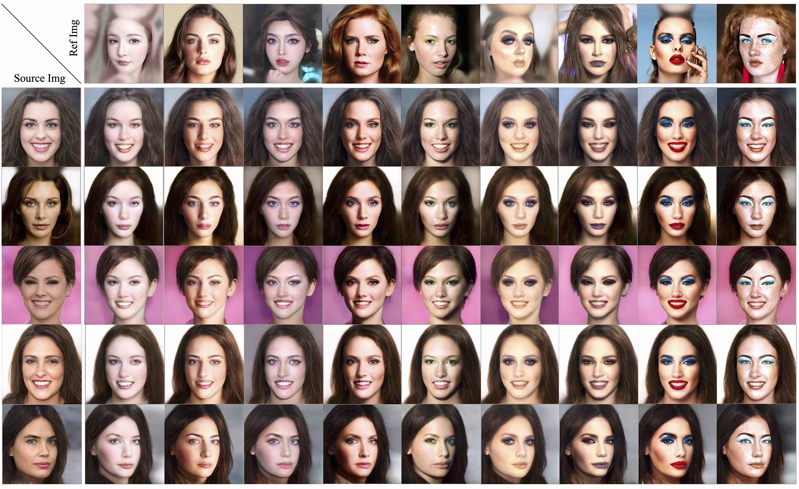

# BeautyBank: Encoding Facial Makeup in Latent Space

This repository contains the official PyTorch implementation of the following paper: https://arxiv.org/abs/2411.11231


## Installation

### Clone this repo:

```bash
git clone https://github.com/CyberAgentAILab/BeautyBank.git
cd BeautyBank
```

### Dependencies:

All dependencies for defining the environment are provided in the `environment` folder. We provide two versions of the Conda environment files:

1. **Full environment** (with specific package versions, recommended for exact reproducibility):
   ```bash
   conda env create -f ./environment/BeautyBank_env_full.yaml
   ```

2. **Minimal environment** (only explicitly installed packages, no strict versioning, for flexibility):
   ```bash
   conda env create -f ./environment/BeautyBank_env_minimal.yaml
   ```

### CUDA and PyTorch Compatibility:

- The system runs on **NVIDIA Tesla T4 GPUs**.
- CUDA version: **11.6**
- Recommended PyTorch version: **PyTorch 1.7.1 with CUDA 10.1 support** (other versions may also work but are not guaranteed)

To install the recommended PyTorch version, use:

```bash
pip install torch==1.7.1 torchvision==0.8.2 torchaudio==0.7.2 --index-url https://download.pytorch.org/whl/cu101
```

## Download data and models

### (1) Dataset Preparation

The dataset used for this project is the **Bare-Makeup Synthesis Dataset (BMS)**, which is available on Hugging Face:

📂 **[Download from Hugging Face](https://huggingface.co/datasets/lulululululululululu/Bare-Makeup-Synthesis-Dataset)**


The dataset are under the following folder structure::

```
data
├── makeup                 # Main dataset for training and evaluation
│   ├── images
│   │   ├── train
│   │   │   ├── image_001.jpg
│   │   │   ├── image_002.jpg
│   │   ├── test
│   │   │   ├── image_101.jpg
│   │   │   ├── image_102.jpg
│   ├── masks                   # Masks generated by face-parsing (for training only)
│   │   ├── train
│   │   │   ├── background
│   │   │   │   ├── image_001.jpg
│   │   │   │   ├── image_002.jpg
│   │   │   ├── eyes
│   │   │   │   ├── image_001.jpg
│   │   │   │   ├── image_002.jpg
│   │   │   ├── face
│   │   │   │   ├── image_001.jpg
│   │   │   │   ├── image_002.jpg
│   │   │   ├── foreground
│   │   │   │   ├── image_001.jpg
│   │   │   │   ├── image_002.jpg
│   │   │   ├── mouth
│   │   │   │   ├── image_001.jpg
│   │   │   │   ├── image_002.jpg
```

Prepare the dataset located in `./data/makeup/images/train/`. First, create the LMDB datasets by running:

```bash
python ./model/stylegan/prepare_data.py --out LMDB_PATH --n_worker N_WORKER --size SIZE1,SIZE2,SIZE3,... DATASET_PATH
```

- **LMDB_PATH**: Path where the LMDB dataset will be saved (e.g., `./data/makeup/lmdb/`).
- **SIZE1,SIZE2,SIZE3,...**: Image sizes to generate (e.g., `1024`).
- **DATASET_PATH**: Path to the dataset (e.g., `./data/makeup/images/`)

### (2) Pretrained Models for Inference

Our pretrained models for inference are composed of the following components:

1. **Encoder Model**:
   - `encoder.pt`: A Pixel2style2pixel encoder that embeds FFHQ images into StyleGAN2 Z+ latent code.
   📂 **[Download encoder.pt](https://drive.google.com/file/d/1NgI4mPkboYvYw3MWcdUaQhkr0OWgs9ej/view)**
   
2. **Makeup Models**:
   - `generator.pt`: The BeautyBank model for makeup synthesis.
   - `sampler.pt`: The sampler model, used to refine the generated makeup styles.
   📂 **[Download from Hugging Face](https://huggingface.co/lulululululululululu/BeautyBank-Model/tree/main)**

3. **Makeup Code Data**:
   - `refined_makeup_code.npy`: Makeup codes.
   📂 **[Download from Hugging Face](https://huggingface.co/datasets/lulululululululululu/BeautyBank-Inference-Dataset)**

Directory Structure for Checkpoints (for inference only):

```
📂 checkpoint
├── 📂 makeup
│   ├── generator.pt               # BeautyBank model
│   ├── refined_makeup_code.npy    # Makeup codes
│   ├── sampler.pt                 # The makeup style code sampling model
├── encoder.pt                     # Pixel2style2pixel model
```

### (3) Pretrained Models for Training

These models are necessary for training and should be placed in the `checkpoint` folder:

- `stylegan2-ffhq-config-f.pt`: StyleGAN model trained on FFHQ (from rosinality). 
   📂 **[Download stylegan2-ffhq-config-f.pt](https://drive.google.com/file/d/1EM87UquaoQmk17Q8d5kYIAHqu0dkYqdT/view)**
   
- `model_ir_se50.pth`: Pretrained IR-SE50 model for ID loss (from TreB1eN).
   📂 **[Download model_ir_se50.pth](https://drive.google.com/file/d/1KW7bjndL3QG3sxBbZxreGHigcCCpsDgn/view)**

Directory Structure for Checkpoints (for training only):

```
📂 checkpoint
├── encoder.pt                     # Pixel2style2pixel model
├── model_ir_se50.pth              # IR-SE50 model for ID loss
├── stylegan2-ffhq-config-f.pt     # StyleGAN model (FFHQ)
```

## Usage

### Inference

#### **1. Makeup Transfer**



To run the makeup transfer script, you can use one of the following methods:

##### Method 1: Simple Command

```bash
python ./inference/run_makeup_transfer.py
```

This will run the script with default settings.

##### Method 2: Detailed Command with Parameters

If you need more control over the process, you can use the following command to specify additional parameters:

```bash
python ./inference/makeup_transfer.py \
    --style makeup \
    --style_id 0 \
    --makeup_name refined_makeup_code.npy \
    --content ./data/makeup/images/test/003767.png \
    --output_path ./output/makeup/ \
    --weight 1 1 1 1 1 1 1 1 1 1 1 1 1 1 1 1 1 1 \
    --align_face
```

##### Arguments:
- **`--style`**: Type of transformation (e.g., `makeup`).
- **`--style_id`**: ID for the makeup style to apply (e.g., `0` for the first style).
- **`--makeup_name`**: Path to the refined makeup code file (e.g., `refined_makeup_code.npy`).
- **`--content`**: Path to the bare-face image (e.g., `./data/makeup/images/test/003767.png`).
- **`--output_path`**: Directory where the output image will be saved (e.g., `./output/makeup/`).
- **`--weight`**: Weights for different parts of the transformation.
- **`--align_face`**: Flag to indicate whether the face should be aligned for better results.

This command will apply the makeup transformation based on the provided makeup style, bare-face image, and other parameters and save the result in the specified output directory.

#### **2. Facial Images Generation with Makeup Injection**


We generate facial images with makeup injection by modifying random Gaussian noise to replace the bare-face code. This technique allows for diverse face generation while retaining the specified makeup. 

##### Process Overview:
- We randomly select several sets of encoded makeup codes.
- For each makeup code, random Gaussian noises are generated to replace the bare-face code.
- The fusion module of **BeautyBank** is then applied to create the facial image, incorporating the makeup while varying other aspects like expressions, poses, genders, and hairstyles.

To generate facial images with makeup injection, you can run the following two versions of the script depending on your preference for simplicity or more control over the parameters.

##### Method 1: Simple Command

If you prefer a quick and straightforward way to generate facial images with makeup, you can use the following command:

```bash
python ./inference/run_generate_face.py
```

This will run the script with default settings and generate the facial images based on the pre-configured parameters.

##### Method 2: Detailed Command with Parameters

For more flexibility and control over the generation process, you can run the script with specific arguments. Use the following command:

```bash
python ./inference/generate_face.py \
    --style makeup \
    --style_id 0 \
    --content ./data/makeup/images/test/003767.png \
    --makeup_name refined_makeup_code.npy \
    --output_path ./output/makeup/ \
    --weight 1 1 1 1 1 1 1 1 1 1 1 1 1 1 1 1 1 1 1 \
    --align_face
```

##### Arguments:
- **`--style`**: Specifies the type of transformation to apply (e.g., `makeup`).
- **`--style_id`**: ID for the specific makeup style (e.g., `0` for the first style).
- **`--content`**: Path to the default input content image (e.g., `./data/makeup/images/test/003767.png`).
- **`--makeup_name`**: Path to the refined makeup code file (e.g., `refined_makeup_code.npy`).
- **`--output_path`**: Directory where the output facial images will be saved (e.g., `./output/makeup/`).
- **`--weight`**: Weights for different aspects of the transformation.
- **`--align_face`**: Option to align the face for better consistency in the generated results.


#### **3. Makeup Interpolation**


Makeup interpolation allows seamless transitions between different makeup styles by interpolating either the bare-face codes or the makeup codes. Since **BeautyBank** includes two style paths, interpolation between different source images and reference makeup styles is achieved by blending these codes, enabling smooth transitions in makeup styles.

##### Method 1: Simple Command

To quickly perform makeup interpolation using default parameters, you can use the following command:

```bash
python ./inference/run_interpolate_makeup.py
```

This will execute the makeup interpolation with pre-set configurations, interpolating between two makeup codes for facial image generation.

##### Method 2: Detailed Command with Parameters

For more flexibility and control over the interpolation process, you can run the script with specific arguments. The following command allows you to specify the two source images, corresponding makeup styles, and other parameters:

```bash
python ./inference/interpolate_makeup.py \
    --align_face \
    --style makeup \
    --content ./data/makeup/images/test/003767.png \
    --content2 ./data/makeup/images/test/083311.png \
    --makeup_name_1 refined_makeup_code.npy \
    --style_id 0 \
    --makeup_name_2 refined_makeup_code.npy \    # can be different npy files
    --style_id2 1
```

##### Arguments:
- **`--align_face`**: Flag to align the face for better results during interpolation.
- **`--style`**: Name of the style for the first source makeup.
- **`--content`**: Path to the first content image for makeup interpolation.
- **`--content2`**: Path to the second content image for makeup interpolation.
- **`--makeup_name_1`**: Path to the first refined makeup code file.
- **`--style_id`**: The style ID for the first makeup style.
- **`--makeup_name_2`**: Path to the second refined makeup code file.
- **`--style_id2`**: The style ID for the second makeup style.

#### Important Notes

- **Non-Makeup Features Disentanglement**: The current `refined_makeup_code.npy` files have not undergone Non-Makeup Features Disentanglement. Performing this step can significantly enhance the performance of generation and transfer tasks.


### Training

### 0. Preprocess Image

We use [face-parsing.PyTorch](https://github.com/zllrunning/face-parsing.PyTorch) to preprocess images before applying makeup transfer. Please ensure that your environment is configured according to the requirements of the face-parsing project.

For your convenience, we provide an `inference.py` script located in the `./script/` folder. To enable preprocessing, please copy this script into the `./face-parsing.PyTorch/` directory. The processed mask images will be saved in `./data/makeup/masks`.

To run face parsing and generate masks, execute the following command:

```bash
python ./face-parsing.PyTorch/inference.py --data ./data/makeup/images/train --output_path ./data/makeup/masks
```

### 1. Fine-tune StyleGAN

```bash
python ./training/finetune_stylegan.py --path LMDB_PATH --batch BATCH_SIZE \
       --ckpt FFHQ_MODEL_PATH --iter ITERATIONS --augment 
```

#### Arguments:
- **`--path`**: LMDB folder path (e.g., `./data/makeup/lmdb/`).
- **`--batch`**: Batch size (e.g., `4`).
- **`--ckpt`**: Path to the StyleGAN checkpoint (e.g., `./checkpoint/stylegan2-ffhq-config-f.pt`)
- **`--iter`**: Iteration of fine-tuning (e.g., `600`).

The fine-tuned StyleGAN model can be found in `./checkpoint/makeup/finetune-000600.pt`. Intermediate results are saved in `./log/makeup/`.


### 2. Encoding Bare-face 

```bash
python ./training/demakeup.py --model_name FINETUNED_MODEL_NAME --batch BATCH_SIZE --iter ITERATIONS 
```

#### Arguments:
- **`--model_name`**: Fine-tuned StyleGAN model (e.g., `finetune-000600.pt`).
- **`--batch`**: Batch size (e.g., `1`)
- **`--iter`**: Number of iterations (e.g., `300`).

The bare-face code and initial makeup codes are saved in `./checkpoint/makeup/bareface_code.npy` and `./checkpoint/makeup/makeup_code.npy`, respectively.

### 3. Pretrain BeautyBank on FFHQ

Our BeautyBank network training is based on DualStyleGAN. Therefore, we initialize BeautyBank using the pretrained network parameters of DualStyleGAN.  

The pretrained model used for initialization can be downloaded from the following link:  
📂 **[Download Pretrained Model](https://drive.google.com/file/d/1j8sIvQZYW5rZ0v1SDMn2VEJFqfRjMW3f/view)**
After downloading, please place the file inside the `checkpoint/`.

### Fine-Tune BeautyBank on Makeup Domain.

```bash
python ./training/finetune_beautybank.py --iter ITERATIONS \ 
                          --batch BATCH_SIZE --ckpt PRETRAINED_MODEL_PATH --augment 
```

#### Arguments:
- **`--iter`**: Number of iterations (e.g., `1500`).
- **`--batch`**: Batch size (e.g., `4`)
- **`--ckpt`**: Path to the checkpoint of the pretrained model (e.g., `./checkpoint/generator-pretrain.pt`)

The fine-tuned models can be found in `./checkpoint/makeup/generator-ITER.pt` where ITER = 001000, 001100, ..., 001500. Intermediate results are saved in `./log/makeup/`. We use 1400 for our paper experiments.

> **Note**  
> Please be aware of memory limitations during fine-tuning.  
> You can reduce the number of training images by limiting the contents of the folder `./data/makeup/images/train/`.

### 4. Optimize Detail-Oriented Latent (Sec 3.3.2, Stage 1)

```bash
python ./training/refine_makeup.py --ckpt MODEL_PATH --iter ITERATIONS
```

#### Arguments:
- **`--ckpt`**: Path to the checkpoint (e.g., `./checkpoint/makeup/generator-001400.pt`).
- **`--iter`**: Iteration of Refining (e.g., `300`).

The refined extrinsic style codes are saved in `./checkpoint/makeup/refined_makeup_code.npy`. 

### 5. Train Sampling Network

```bash
python ./training/train_sampler.py
```

The saved model can be found in `./checkpoint/makeup/sampler.pt`.

## Disentangle Non-Makeup Features (Sec 3.3.2, Stage 2)

Our paper discusses various feasible approaches for disentangling non-makeup features.  
We provide an implementation that utilizes a background mask to achieve feature disentanglement.

```bash
python ./training/refine_unrelated.py --lr_color COLOR_LEARNING_RATE --lr_structure STRUCTURE_LEARNING_RATE  \
   --ckpt MODEL_PATH --makeup_path MAKEUP_PATH   --bareface_path BAREFACE_PATH  \
   --makeup_file MAKEUP_FILE_NAME   --bareface_file BAREFACE_FILE_NAME \
   --iter ITERATIONS
```

#### Arguments:
- **`--lr_color`**: Weight for color refinement (e.g., `0.1`).
- **`--lr_structure`**: Weight for structure refinement (e.g., `0.005`)
- **`--ckpt`**: Path to the checkpoint (e.g., `./checkpoint/makeup/generator-001400.pt`).
- **`--makeup_path`**: Path to the makeup codes (e.g., `./checkpoint/makeup/refined_makeup_code.npy`).
- **`--bareface_path`**: Path to the bareface files (e.g., `./data/makeup/images/test/`).
- **`--bareface_mask_path`**: Path to the masks of bareface files (e.g., `./data/makeup/masks_test/`).
- **`--makeup_file`**: Filename of the makeup (e.g., `083311.png`).
- **`--bareface_file`**: Filename to the bareface (e.g., `003767.png`).
- **`--iter`**: Iteration of Refining (e.g., `300`).

> **Note**  
> Before running the fine-tuning code, you need to preprocess the bare-face images using `./face-parsing.PyTorch/inference.py`.  
> Use the following command:

```bash
python ./face-parsing.PyTorch/inference.py --data ./data/makeup/images/test --output_path ./data/makeup/masks_test
```


## Citation

```bibtex
@INPROCEEDINGS{10943424,
  author = { Lu, Qianwen and Yang, Xingchao and Taketomi, Takafumi },
  booktitle = { 2025 IEEE/CVF Winter Conference on Applications of Computer Vision (WACV) },
  title = {{ BeautyBank: Encoding Facial Makeup in Latent Space }},
  year = {2025},
  pages = {4183-4193},
  doi = {10.1109/WACV61041.2025.00411},
  url = {https://doi.ieeecomputersociety.org/10.1109/WACV61041.2025.00411},
  publisher = {IEEE Computer Society},
  url={https://github.com/CyberAgentAILab/BeautyBank.git}
```

## License

This project is licensed under the [MIT License](LICENSE).

[poetry]: https://python-poetry.org/
[pre-commit]: https://pre-commit.com/
